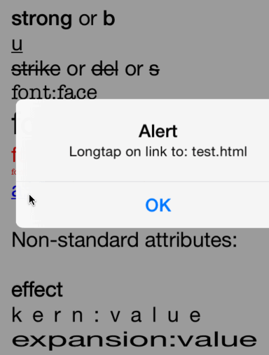

# HTML to Attributed String

[](https://david-dm.org/fokkezb/ti-html2as#info=dependencies)
[](https://david-dm.org/fokkezb/ti-html2as#info=devDependencies)

HTML to [Ti.UI.iOS.AttributedString](http://docs.appcelerator.com/titanium/latest/#!/api/Titanium.UI.iOS.AttributedString) parser for [Titanium](http://appcelerator.com/titanium).

## Screencast



## Usage
A packaged *CommonJS* module can be found via [Releases](https://github.com/fokkezb/ti-html2as/releases). Follow the guide on [Using a Module](http://docs.appcelerator.com/titanium/latest/#!/guide/Using_a_Module) or use gitTio:

	gittio install nl.fokkezb.html2as

The module exports a single function that takes an HTML string and a callback to receive an error or [Ti.UI.iOS.AttributedString](http://docs.appcelerator.com/titanium/latest/#!/api/Titanium.UI.iOS.AttributedString) object.

```
var html2as = require('nl.fokkezb.html2as');

html2as(
	'<font size="17" face="AmericanTypewriter">Hello <b>Bold</b> <a href="http://tidev.io">World</a></font>',
	function(err, as) {

		if (err) {
			console.error(err);

		} else {

			var label = Titanium.UI.createLabel({
				attributedString: as
			});

			label.addEventListener('link', function(e) {
				alert('Longtap on link to: ' + e.url);
			});

			view.add(label);
		}
	}
);
```

### Alloy

In Alloy you can use the [XP.UI](https://github.com/FokkeZB/UTiL/tree/master/xp.ui#tag-label) CommonJS module to emulate the `html` attribute Android has for `<Label />`:

```
<Alloy>
	<Window>
		<Label module="xp.ui" html="<font size=17>Hello <b>Bold</b> <font color=#FF0000>World!</font></font>" />
	</Window>
</Alloy> 
```

Or you can use the [Widget](https://github.com/FokkeZB/nl.fokkezb.html2as.widget), which has the advantage that you can set the `html` property in a later stage as well:

```
<Alloy>
	<Window>
		<Widget src="nl.fokkezb.html2as.widget" html="<font size=17>Hello <b>Bold</b> <font color=#FF0000>World!</font></font>" />
	</Window>
</Alloy> 
```

## Supported tags and attributes

Standard (old) HTML:

* `<strong>`, `<b>`
* `<u>`
* `<em>`, `<i>`
* `<strike>`, `<del>`, `<s>`
* `<font face="Arial" size="12" color="red">`
* `<a href="http://appcelerator.com">`

Non-standard: 

* `<effect>` (letterpress-style)
* `<kern value="10">` (spacing between characters)
* `<expansion value="0.5">` (stretch text horizontally)

## Example
The [example](example) folder includes a Titanium project demonstrating the module. To build the module and then run the example project use the included grunt tasks:

```
npm install
grunt
```

## Changelog

* 1.2.0: Adds [support for HTML entities](https://github.com/FokkeZB/ti-html2as/pull/5)
* 1.1.0: Updated for Titaniumifier 1.0.0
* 1.0.0: Initial version

## Issues

Please report issues and features requests in the repo's [issue tracker](https://github.com/fokkezb/ti-html2as/issues).


## Credits

* [@patrickknaap](https://github.com/patrickknaap) for adding support of HTML entities
* [@fb55](https://github.com/fb55) for [htmlparser2](https://github.com/fb55/htmlparser2)
* [@smclab](https://github.com/smclab/titaniumifier) for [titaniumifier](https://github.com/smclab/titaniumifier)


## License

This library, *ti-html2as*, is free software ("Licensed Software"); you can
redistribute it and/or modify it under the terms of the [GNU Lesser General
Public License](http://www.gnu.org/licenses/lgpl-2.1.html) as published by the
Free Software Foundation; either version 2.1 of the License, or (at your
option) any later version.

This library is distributed in the hope that it will be useful, but WITHOUT ANY
WARRANTY; including but not limited to, the implied warranty of MERCHANTABILITY,
NONINFRINGEMENT, or FITNESS FOR A PARTICULAR PURPOSE. See the GNU Lesser General
Public License for more details.

You should have received a copy of the [GNU Lesser General Public
License](http://www.gnu.org/licenses/lgpl-2.1.html) along with this library; if
not, write to the Free Software Foundation, Inc., 51 Franklin Street, Fifth
Floor, Boston, MA 02110-1301 USA
